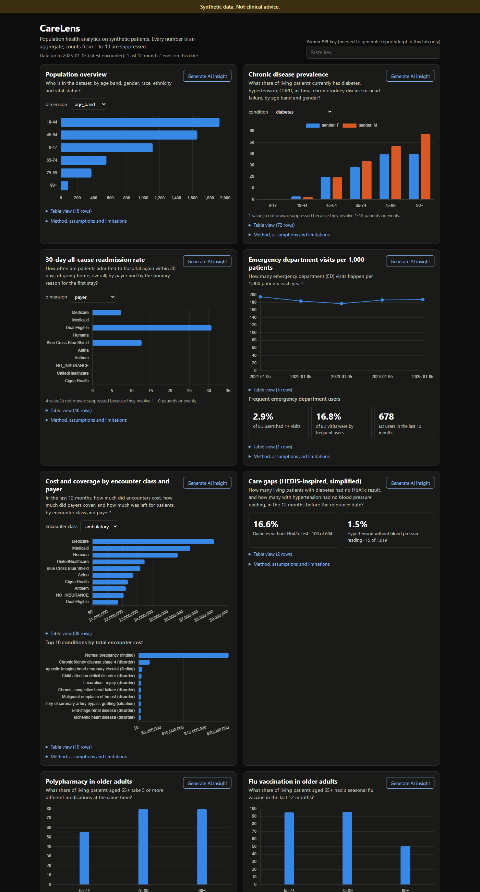
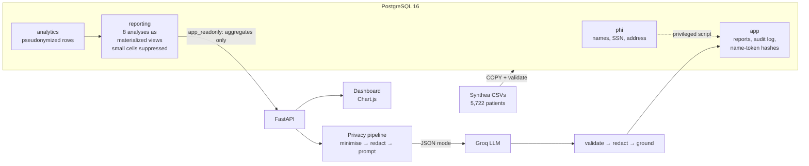

# CareLens

[](https://github.com/khushichhabra7921/CareLens/actions/workflows/ci.yml)

**Population health analytics on synthetic patient data, with AI insight reports that are
privacy-safe by design.** SQL analytics on PostgreSQL, a FastAPI + Chart.js dashboard, and an
LLM report pipeline that only ever sees suppressed aggregates, redacts and blocks identifiers,
and checks every number it writes against the data.

> **Synthetic data. Not clinical advice.** All patients are generated by
> [Synthea](https://github.com/synthetichealth/synthea); the project treats them exactly as if
> they were real patient data.



## Why it matters

Health systems need population-level answers: who is readmitted within 30 days, which diabetic
patients missed their HbA1c test, how many older adults take five or more medications. The data
behind those answers is the most sensitive there is. Tools that add AI summaries on top raise a
second question: how do you use an LLM **without** sending it patient records, and how do you
know it didn't make a number up? CareLens is a small, end-to-end answer to both.

## Architecture



On AWS (Mumbai): CloudFront (HTTPS) → EC2 t4g.micro (Docker) → RDS PostgreSQL (private,
TLS verify-full), deployed from GitHub Actions with OIDC. See [docs/DEPLOYMENT.md](docs/DEPLOYMENT.md).

## How privacy is enforced

1. **The web app's database role can read only aggregate views.** `app_readonly` has no access
   to `phi` (identifiers) or even to `analytics` (row-level clinical data), so no endpoint, bug
   or SQL injection can return a patient row. Proven by tests.
2. **Small-cell suppression** (CMS policy): counts 1-10, rates built on them, and totals that
   would reveal them by subtraction are hidden in SQL, before the data leaves the database.
3. **The LLM only receives an allowlisted, aggregate-only payload**, with dates cut to year-month.
4. **Redaction as defence in depth** on the way out and back in (SSN, phone, email, UUID, dates,
   ZIPs, and patient names matched by keyed hash, so the app never sees raw names). A direct
   identifier in the outgoing data **blocks** the request.
5. **Untrusted-data prompt** with random-nonce delimiters; prompt-injection screening.
6. **Grounding:** every number in a finding must exist in the data sent; ungrounded findings are
   dropped, then retried once, then replaced by a rule-based template report.
7. **Audit log** (append-only for the app): payload SHA-256, redaction counts, grounding result,
   tokens, fallback reason.

Full threat model and HIPAA Safe Harbor mapping: [docs/RESPONSIBLE_AI.md](docs/RESPONSIBLE_AI.md).

## Run it locally (Windows / PowerShell)

Prerequisites: Docker Desktop, Python 3.12, Java 17+. One-time setup:
`Copy-Item .env.example .env` (fill in the values it describes), then
`py -3.12 -m venv .venv; .\.venv\Scripts\Activate.ps1; pip install -r requirements-dev.txt`.

```bash
docker compose up --build -d
```
```bash
py -3.12 scripts/generate_data.py
```
```bash
py -3.12 scripts/load_data.py
```

Open http://127.0.0.1:8000. Without a Groq key, reports use the template fallback; add
`GROQ_API_KEY` and `LLM_MODEL` to `.env` for AI reports. Tests: `pytest` (needs the Docker DB).

## Live demo

The AWS deployment runs **on demand** to stay far inside the Free plan's credits (idle cost
$3.37/month, $0.03/hour while running): it is started before a demo with
`py -3.12 infra/ops.py start` (about 5 minutes: a cold start) and stops itself every night.
Public URL: see [docs/DEPLOYMENT.md](docs/DEPLOYMENT.md#live-url).

## Key findings (5,722 synthetic patients, data through 2025-01-05)

Generated by `scripts/export_findings.py`; full tables in [docs/ANALYSES.md](docs/ANALYSES.md).

| Measure | Result |
|---|---|
| Diabetics with no HbA1c test in the last 12 months | **16.6%** (100 of 604) |
| Hypertensive patients with no blood-pressure reading | **1.5%** (15 of 1,019) |
| 30-day readmission rate, Dual Eligible vs Medicare | **30.7%** (47/153) vs **7.4%** (35/474) |
| Polypharmacy (5+ active medications), all 65+ | **65.7%** (517 of 787); 79.5% at 75-89 |
| Flu vaccination in the last 12 months, all 65+ | **91.2%**, but only **50.7%** at 90+ |
| ED visits per 1,000 active patients, latest year | **187.6** (875 visits, 4,663 patients) |
| Care-gap query: without vs with indexes | **254 s → 6.8 ms** (4.27 M observation rows) |

Numbers describe Synthea's simulation, not real-world rates.

## Engineering

- **Data:** Synthea v4.0.0 pinned by SHA-256, fixed seeds and end date (reproducibility checked:
  identical rows across runs); idempotent COPY loader, 5,881,290 rows, 0 rejected, every row
  validated in SQL with rejected rows kept (with reasons) in a loader-only table.
- **SQL:** 8 analyses as plain `.sql` files with question/method/assumptions/limitations headers,
  window functions (LEAD for readmissions), materialized views, CHECK/FK constraints tested
  against the real data before being added.
- **Tests:** 178 tests (hand-computed fixture cohorts for every analysis, role privileges, every
  endpoint checked for leaked identifiers, a mocked LLM for every failure path); 98% coverage of
  the privacy and LLM code; CI with a Postgres service container, a Docker smoke test and
  SHA-pinned actions.
- **Decisions** (and mistakes caught along the way): [docs/DECISIONS.md](docs/DECISIONS.md).

## Credits and third-party code

- [Synthea](https://github.com/synthetichealth/synthea) (Apache 2.0): generates the synthetic
  patients. Downloaded by `scripts/generate_data.py`, pinned to v4.0.0 by SHA-256, not stored here.
- [Chart.js](https://www.chartjs.org/) 4.5.1 (MIT): `app/static/vendor/chart.umd.min.js`, vendored
  unchanged (hash in `app/static/vendor/README.md`).
- Amazon RDS CA certificate bundle (public): `app/certs/rds-global-bundle.pem`, unchanged (source
  and hash in `app/certs/README.md`).
- Clinical code sets come from the Synthea data and CDC's public CVX table; the HIPAA Safe Harbor
  guidance and ZIP3 list come from HHS. All other code in this repository was written for it.

## Limitations and next steps

- Synthea's data reflects its disease models and Massachusetts demographics, and exports ~10
  years of history; results are illustrative only.
- Simple (not complementary) suppression; regex redaction has blind spots (see RESPONSIBLE_AI.md).
- Grounding checks numbers, not meaning.
- Next: complementary suppression, CloudFront VPC origins (TLS to the server), an expert
  determination review before any real data, and CodeLens AI as a blocking CI gate once its
  path-join false positive is fixed.
